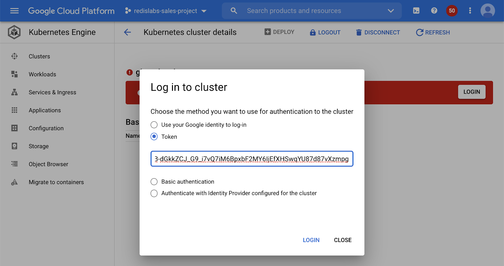
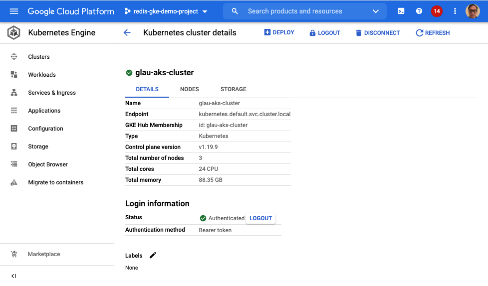
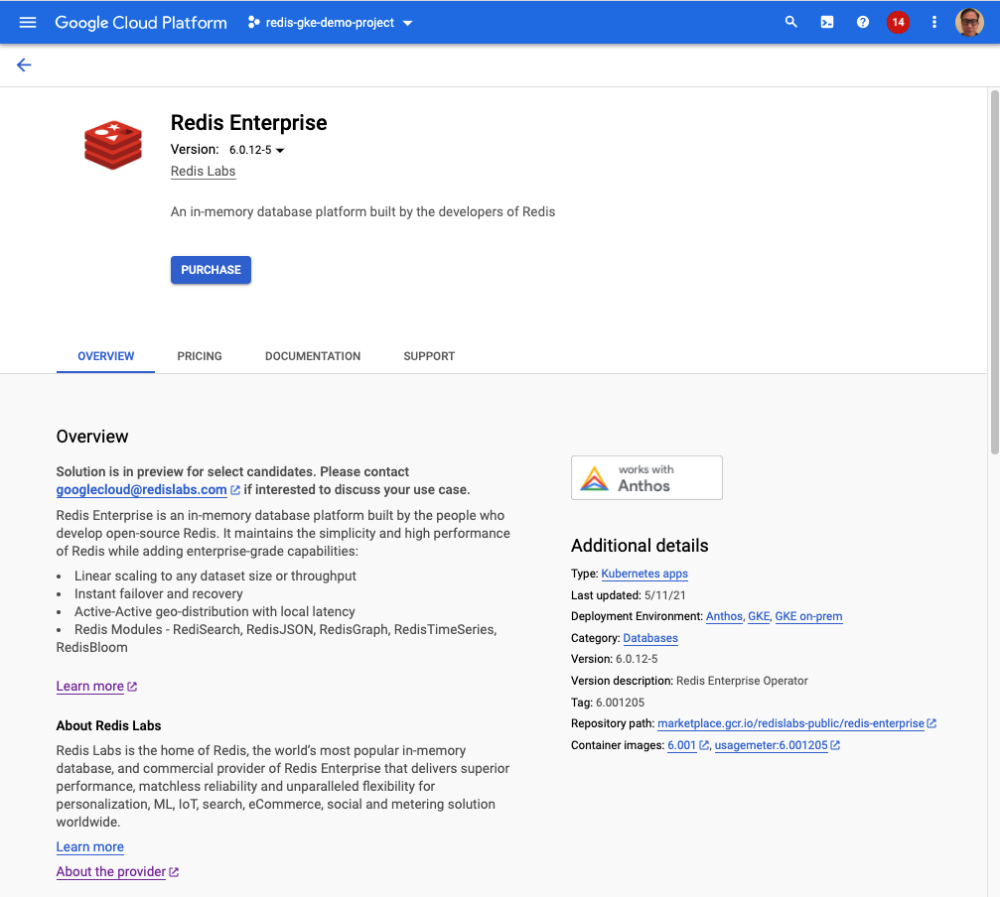
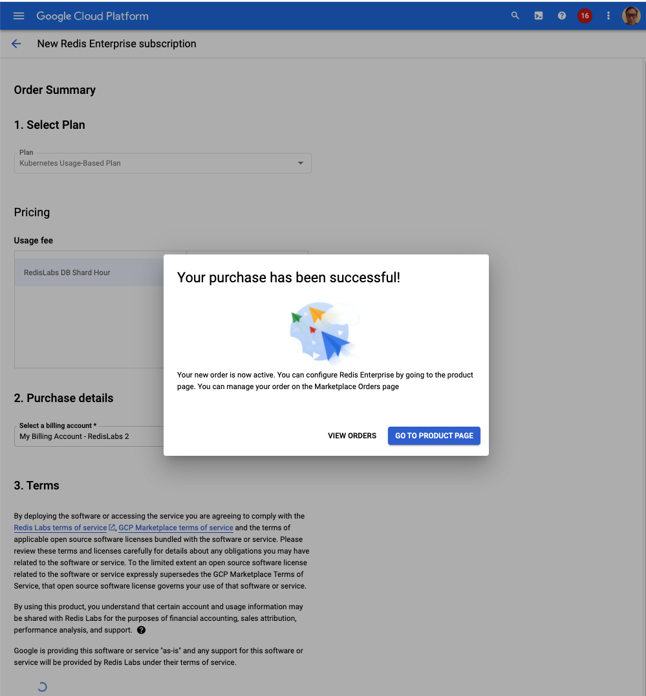
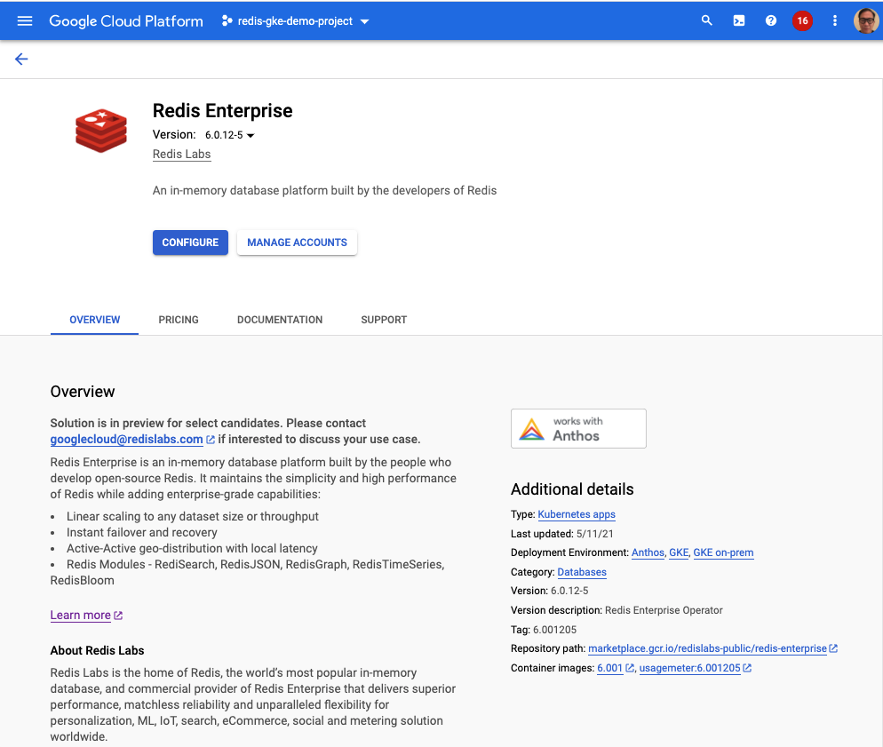
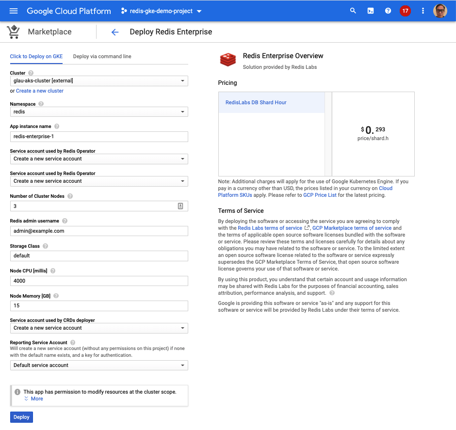
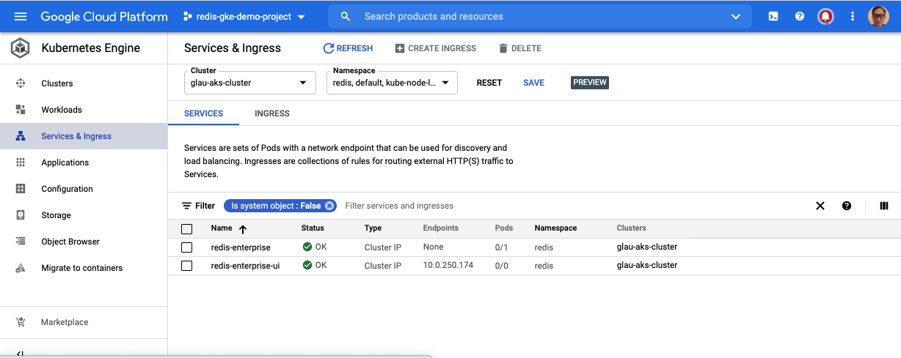

## How to deploy Redis Enterprise on GKE vi GCP Marketplace to an Anthos attached AKS cluster

### High Level Workflow
The following is the high level workflow which you will follow:
1. Create an AKS cluster if you do not have one already
2. Register the AKS cluster as attached (external) Kubernetes cluster
3. Authenticate the attached AKS cluster using bearer token
4. Configure the attached AKS cluster to pull images from Google Container Registry (GCR)
5. Configure the attached AKS cluster to allow images on Marketplace's GCR being pulled from your deployment K8 namespace
6. Deploy Redis Enterprise on GKE via GCP Marketplace on your designated K8 namespace

#### 1. Create an AKS cluster 
```
az aks create \
--resource <your-resource-group> \
--name <your-aks-cluster-name> \
--node-count <worker-node-count> \
--node-vm-size <vm-machine-type> \
--generate-ssh-keys

For example,
az aks create \
--resource glau-rg \
--name glau-aks-cluster-3n \
--node-count 3 \
--node-vm-size standard_d4_v2 \
--generate-ssh-keys
```
---

#### 2. Register the AKS cluster as attached Kubernetes cluster
Create a GCP service account with relevant roles to attach the cluster to GCP
```
export PROJECT=$(gcloud config get-value project)
gcloud iam service-accounts create anthos-hub \
	--project=${PROJECT}
gcloud iam service-accounts list \
	--project=${PROJECT}
gcloud projects add-iam-policy-binding ${PROJECT} \
--member="serviceAccount:anthos-hub@${PROJECT}.iam.gserviceaccount.com" \
--role="roles/gkehub.connect"
```

Generate a JSON key from the service account
```
gcloud iam service-accounts keys create ./anthos-hub-svc.json \
  --iam-account="anthos-hub@${PROJECT}.iam.gserviceaccount.com" \
  --project=${PROJECT}
```

Register the AKS cluster
```
gcloud container hub memberships register <MEMBERSHIP-NAME> \
--context=<KUBECONFIG-CONTEXT> \
--kubeconfig=<KUBECONFIG-PATH> \
--service-account-key-file=<SERVICE-ACCOUNT-KEY-PATH>

For example,
gcloud container hub memberships register glau-aks-cluster \
--context=glau-aks-cluster-3n \
--kubeconfig=/Users/gilbertlau/.kube/config \
--service-account-key-file=./anthos-hub-svc.json
``` 

You should see your newly brought AKS cluster with critcal status below.  Once it is authenticated in step 3, the ASK cluster will turn into healthy state.

---

#### 3. Authenticate the attached AKS cluster using bearer token
Create and apply the cloud-console-reader RBAC role
```
cat <<EOF > cloud-console-reader.yaml
kind: ClusterRole
apiVersion: rbac.authorization.k8s.io/v1
metadata:
  name: cloud-console-reader
rules:
- apiGroups: [""]
  resources: ["nodes", "persistentvolumes"]
  verbs: ["get", "list", "watch"]
- apiGroups: ["storage.k8s.io"]
  resources: ["storageclasses"]
  verbs: ["get", "list", "watch"]
EOF
kubectl apply -f cloud-console-reader.yaml
```

Set up a service account (KSA - Kubernetes service account)
```
KSA_NAME=ksa-aks-sa-1
kubectl create serviceaccount ${KSA_NAME}
kubectl create clusterrolebinding ${KSA_NAME}-view-clusterrole-binding \
--clusterrole view --serviceaccount default:${KSA_NAME}
kubectl create clusterrolebinding ${KSA_NAME}-cloud-console-reader-binding \
--clusterrole cloud-console-reader --serviceaccount default:${KSA_NAME}
```

Bind the cluster-admin role to the KSA above to allow deployment of a Kubernetes application from GCP Marketplace
```
kubectl create clusterrolebinding ${KSA_NAME}-cluster-admin-binding \
--clusterrole cluster-admin --serviceaccount default:${KSA_NAME}
```

Get the KSA’s bearer token to log into GCP console
```
SECRET_NAME=$(kubectl get serviceaccount ksa-aks-sa-1 -o jsonpath='{$.secrets[0].name}')
kubectl get secret ${SECRET_NAME} -o jsonpath='{$.data.token}' | base64 --decode
```
Use the output (bearer token) from the above command to log the cluster into GCP

---
You should see the attached AKS cluster now in a healthy state

---

---

#### 4. Configure the attached AKS cluster to pull images from Google Container Registry (GCR)
Create a service account to pull images from GCR
```
gcloud iam service-accounts create gcr-sa \
	--project=${PROJECT}
gcloud iam service-accounts list \
	--project=${PROJECT}
gcloud projects add-iam-policy-binding ${PROJECT} \
--member="serviceAccount:gcr-sa@${PROJECT}.iam.gserviceaccount.com" \
--role="roles/storage.objectViewer"
gcloud iam service-accounts keys create ./gcr-sa.json \
  --iam-account="gcr-sa@${PROJECT}.iam.gserviceaccount.com" \
  --project=${PROJECT}
```

Set up your application-system namespace with a Secret to access Container Registry
```
kubectl create ns application-system
JSON_KEY_FILENAME=./gcr-sa.json
IMAGEPULLSECRET_NAME=gcr-json-key
kubectl create secret docker-registry $IMAGEPULLSECRET_NAME \
  --namespace="application-system" \
  --docker-server=gcr.io \
  --docker-username=_json_key \
  --docker-password="$(cat $JSON_KEY_FILENAME)"

kubectl patch sa default -n application-system -p '"imagePullSecrets": [{"name": "gcr-json-key" }]'
```
---

#### 5. Configure the attached AKS cluster to allow images on Marketplace's GCR being pulled from your deployment K8 namespace
```
NAMESPACE=redis
kubectl create ns $NAMESPACE
JSON_KEY_FILENAME=./gcr-sa.json
IMAGEPULLSECRET_NAME=gcr-json-key
kubectl create secret docker-registry $IMAGEPULLSECRET_NAME \
  --namespace=$NAMESPACE \
  --docker-server=gcr.io \
  --docker-username=_json_key \
  --docker-password="$(cat $JSON_KEY_FILENAME)"

kubectl annotate namespace $NAMESPACE marketplace.cloud.google.com/imagePullSecret=$IMAGEPULLSECRET_NAME
```
You would repeat this step for any additional K8 namespace to deploy Redis Enterprise on GKE via GCP Marketplace


#### 6. Deploy Redis Enterprise on GKE via GCP Marketplace on your designated K8 namespace

Follow the on-screen instructions below to deploy Redis Enterprise on GKE via GCP Marketplace

---

---

---

---

---

---

---


