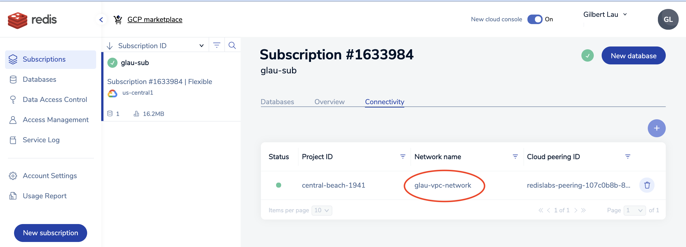

## MemoryStore for Redis Upgrade to Redis Enterprise in GCP Marketplace

This repo details the necessary steps to upgrade from a MemoryStore for Redis instance to a fully managed Redis Enterprise database in GCP Marketplace using RIOT. RIOT stands for Redis Input/Output tools. It is a suite of utilities designed to help you get data in and out of Redis. To learn more about RIOT, please visit [RIOT Guide](https://developer.redis.com/riot).

We will use [RIOT Redis](https://developer.redis.com/riot/index.html#_riot_redis) to migrate data from an existing MemoryStore for Redis instance to a fully managed Redis Enterprise database LIVE! Meaning any subsequent changes, either adding new data or updating existing data will be propagated from Source (MemoryStore for Redis instance) to Target (fully managed Redis Enterprise database instance) in real time.


## High Level Workflow
The following is the high level workflow which you will follow:
1. Verify prerequisite checklist 
2. Enable keyspace notification for your MemoryStore instance in GCP console
3. Install Redis and RIOT
4. Populate seed data for migration test
5. Use "riot-redis" replicate command to establish live migration connection
6. Verify migration of existing data
7. Verify new key insertion
8. Verify existing key's value update


#### 1. Verify prerequisite checklist
* Collect the primary endpoint of your MemoryStore for Redis instance
* Collect the private endpoint and the password of your fully managed Redis Enterprise database
* Ensure the VPC network your MemoryStore instance is tied to is the same VPC network your fully managed Redis Enterprise subscription is peered 
* Provision a Ubuntu VM in the same VPC network mentioned in the previous step   
The following screen shots will help you locate and ensure the VPC networks are identical. First, verify the authorized VPC network in the MemoryStore instance:
   
&nbsp;  
Verify the VPC netowrk peered with the Redis Enterprise's subcription:    
   
&nbsp;
Verify the VPC network the Ubuntu VM is attached to:    
   
&nbsp;
With the above setup, the database migration will take place all inside Google Cloud's network privately to the customer.  
     

#### 2. Enable keyspace notification for your MemoryStore instance in GCP console
Set "notify-keyspace-events" to **KA** as follows. This is required for live migration. To learn more about keyspace notification, please visit [here](https://redis.io/topics/notifications).
  
    

#### 3. Install Redis and RIOT
SSH into your Ubuntu VM. Then install Redis and RIOT as follows:
```
sudo apt-get install -y redis
```
```
git clone https://github.com/redis-developer/riot.git
```


#### 4. Populate seed data for migration test
SSH into your Ubuntu VM  
Insert a new key to your MemoryStore instance  
```
redis-cli -u redis://<memorystore-primary-endpoint-IP>:<memorystore-primary-endpoint-port>
```
```
> set redis fastest-db
> get redis
```


#### 5. Use "riot-redis" replicate command to establish live migration connection
Open another SSH session with the Ubuntu VM  
Establish a live migration connection as follows:   
```
cd riot/bin

./riot-redis -u redis://<memorystore-primary-endpoint-IP>:<memorystore-primary-endpoint-PORT> \
replicate \
-u redis://<fully-managed-redis-enterprise-db-private-endpoint-IP>:<fully-managed-redis-enterprise-db-private-endpoint-PORT> \
-a <fully-managed-redis-enterprise-db-PASSWORD> \
--mode live

In our example, 
 ./riot-redis -u redis://10.206.224.69:6379 \
replicate \
-u redis://redis-19838.internal.c17096.us-central1-mz.gcp.cloud.rlrcp.com:19838 \
-a oUc0CxTsmed7dWZVPPlcj2tk6eSD343V \
--mode live
```


#### 6. Verify migration of existing data
In your first SSH session with the Ubuntu VM, run the following commands to verify data migration from the Source to Target:  
```
In our example,
redis-cli -u redis://redis-19838.internal.c17096.us-central1-mz.gcp.cloud.rlrcp.com:19838 -a oUc0CxTsmed7dWZVPPlcj2tk6eSD343V 

> get redis

It should return **fastest-db**
```


#### 7. Verify new key insertion 
In the Source (MemoryStore instance):
```
In our example,
redis-cli -u redis://10.206.224.69:6379

> set watch rolex
> get watch
```
In the Target (Redis Enterprise db instance):
```
redis-cli -u redis://redis-19838.internal.c17096.us-central1-mz.gcp.cloud.rlrcp.com:19838 -a oUc0CxTsmed7dWZVPPlcj2tk6eSD343V

> get watch

It should return **rolex**
```


#### 8. Verify existing key's value update
In the Source (MemoryStore instance):
```
In our example,
redis-cli -u redis://10.206.224.69:6379

> set watch panerai
> get watch
```
In the Target (Redis Enterprise db instance):
```
redis-cli -u redis://redis-19838.internal.c17096.us-central1-mz.gcp.cloud.rlrcp.com:19838 -a oUc0CxTsmed7dWZVPPlcj2tk6eSD343V

> get watch

It should return **panerai**
```


