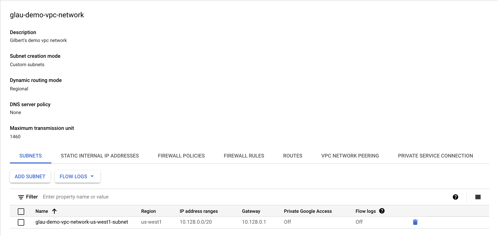
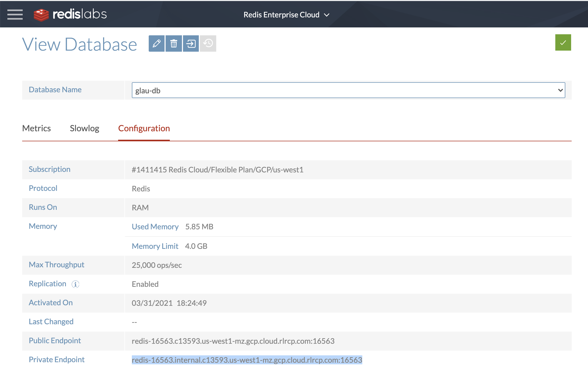
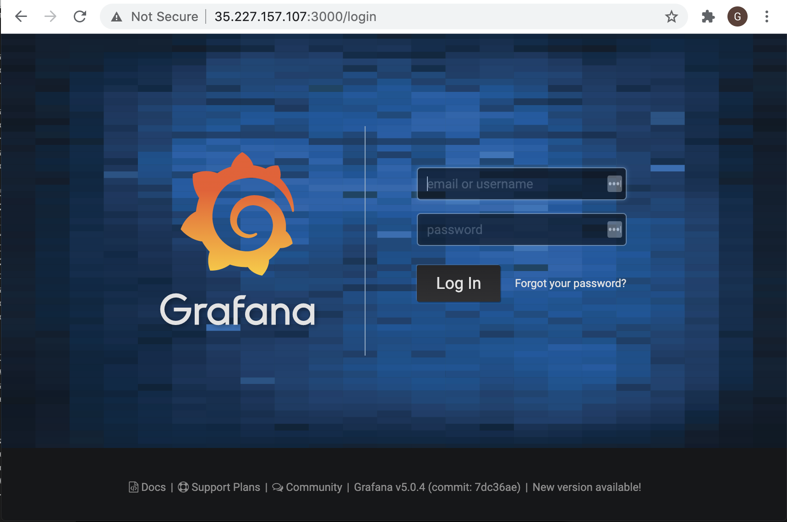
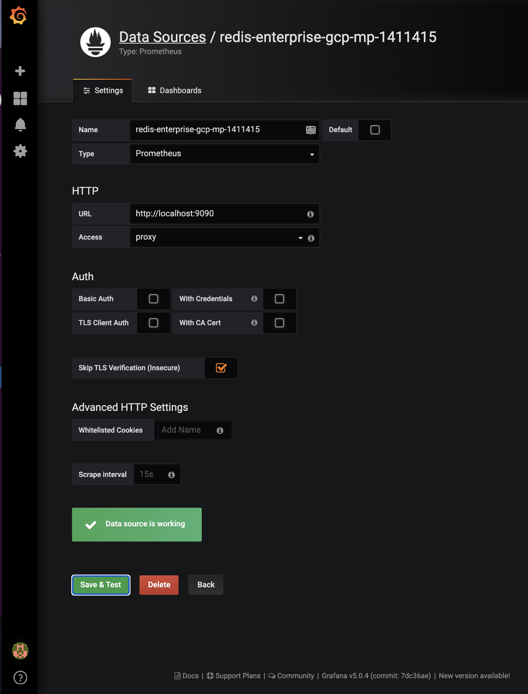
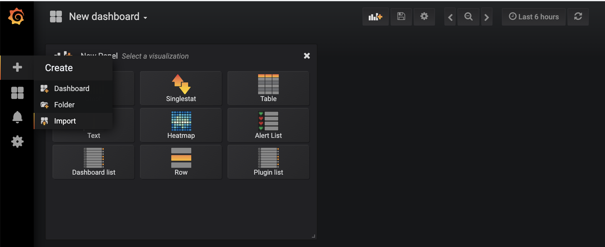
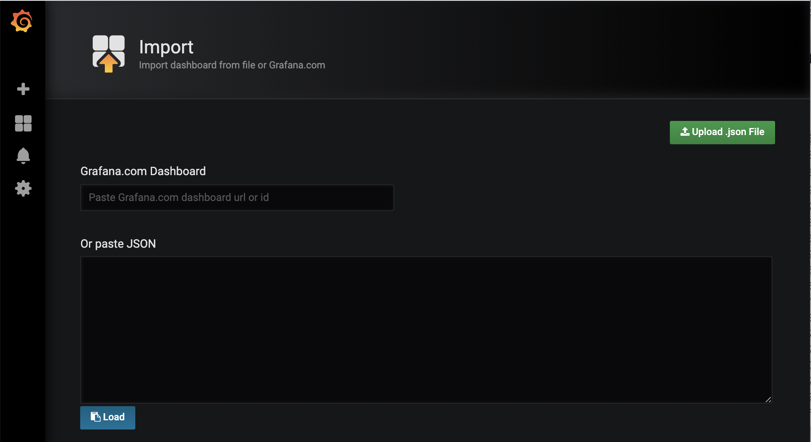
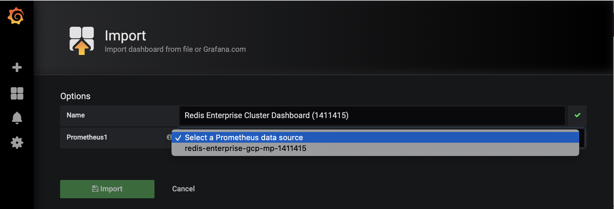
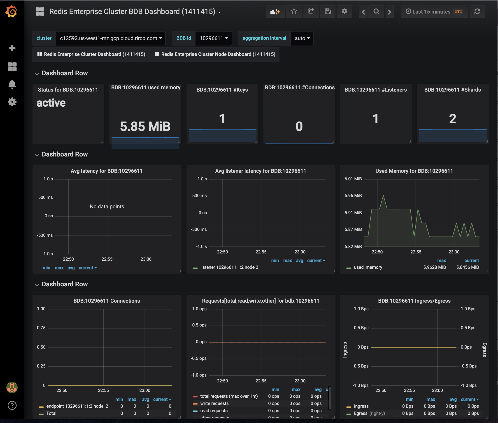

## Set up Prometheus/Grafana to monitor your Google Cloud Platform Marketplace (GCP MP) subscription

### Prerequisites
1. A subscription has been created through your GCP MP's Redis Enterprise purchase 
2. One or more databases have been created in the subscription
3. Network peering has been set up between your GCP project's VPC and the subscription project's VPC

### Procedures
* Set up firewall rules allowing SSH and traffic to Prometheus and Grafana
* Create a VM in your GCP project to install Prometheus and Grafana 
* Install and configure Prometheus to collect monitoring data from the subscription (using private endpoint)
* Install Grafana and configure monitoring dashboards

#### Set up firewal rules allowing SSH and traffic to Prometheus and Grafana
The firewall rules for your GCP project's VPC should look like the following:


#### Create a VM in your GCP project to install Prometheus and Grafana
First off, make sure your VM is in the VPC network peered with your Redis Enterprise for GCP MP subscription. See below.


Install and configure Prometheus:
1. SSH into the VM and run the following commands to install Prometheus
```
$ sudo su -
$ wget https://github.com/prometheus/prometheus/releases/download/v2.1.0/prometheus-2.1.0.linux-amd64.tar.gz
$ tar -xf prometheus-2.1.0.linux-amd64.tar.gz
$ mv prometheus-2.1.0.linux-amd64/prometheus prometheus-2.1.0.linux-amd64/promtool /usr/local/bin
$ mkdir /etc/prometheus /var/lib/prometheus
$ mv prometheus-2.1.0.linux-amd64/consoles prometheus-2.1.0.linux-amd64/console_libraries /etc/prometheus
$ rm -r prometheus-2.1.0.linux-amd64*
```
2. Configure Prometheus  
Create a file called /etc/prometheus/prometheus.yml with the following content.
<pre>
global:
  scrape_interval: 15s
  evaluation_interval: 15s

# Attach these labels to any time series or alerts when communicating with
# external systems (federation, remote storage, Alertmanager).
  external_labels:
    monitor: "prometheus-stack-monitor"

# Load and evaluate rules in this file every 'evaluation_interval' seconds.
#rule_files:
# - "first.rules"
# - "second.rules"

scrape_configs:
# scrape Prometheus itself
  - job_name: prometheus
    scrape_interval: 10s
    scrape_timeout: 5s
    static_configs:
      - targets: ["localhost:9090"]

# scrape Redis Enterprise
  - job_name: redis-enterprise
    scrape_interval: 30s
    scrape_timeout: 30s
    metrics_path: /
    scheme: https
    tls_config:
      insecure_skip_verify: true
    static_configs:
      - targets: ["<b>cluster_name</b>:8070"]
</pre>
Replace the **cluster_name** with the internal cluster name as shown below by going to one of the databases' configuration page and locate the **Private Endpoint** field. 



The part that we need to replace the **cluster_name** in the configuration above is **internal.c13593.us-west1-mz.gcp.cloud.rlrcp.com** in our example.

Run the rest of the commands below to set up Prometheus for auto-start between reboots:
```
$ useradd -rs /bin/false prometheus
$ chown -R prometheus: /etc/prometheus /var/lib/prometheus
```
Create a systemd unit file: /etc/systemd/system/prometheus.service with the following contents:
```
[Unit]
Description=Prometheus
After=network.target

[Service]
User=prometheus
Group=prometheus
Type=simple
ExecStart=/usr/local/bin/prometheus \
    --config.file /etc/prometheus/prometheus.yml \
    --storage.tsdb.path /var/lib/prometheus/ \
    --web.console.templates=/etc/prometheus/consoles \
    --web.console.libraries=/etc/prometheus/console_libraries

[Install]
WantedBy=multi-user.target
```
Reload systemd for changes to take effect:
```
$ systemctl daemon-reload
$ systemctl enable prometheus
$ systemctl start prometheus
```

You can now try to access your Prometheus using this URL: **http://<your_server_IP>:9090/**. In our example, it would be http://35.227.157.107:9090

Enter **node_up** in the Expression field. If Prometheus is connected to the Redis Enterprise cluster, the cluster metrics will be shown like the following:


3. Set up Grafana for Prometheus:
```
$ sudo su -
$ wget https://s3-us-west-2.amazonaws.com/grafana-releases/release/grafana_5.0.4_amd64.deb
$ apt-get install -y adduser libfontconfig
$ dpkg -i grafana_5.0.4_amd64.deb
$ systemctl daemon-reload && systemctl enable grafana-server && systemctl start grafana-server.service
```

You can now connect to it at http://your.server.ip:3000.  In our example, it would be http://35.227.157.107:3000 as shown below:


Log in using username: **admin** & password: **admin**.
This is the screen it should look like after logging in the first time:

 

4. Create dashboards to monitor your subscription

First, we need to configure data source for your subscription. In Grafana, do the followings:
* Click the **Configuration (Gear icon)** and choose the **Data Sources** option:

 

Click **"Add data source"** button. Follow the screen below to enter your "Prometheus" data source for your subscription.  Be sure to check **Skip TLS Verification (Insecure)** option in the form.


After clicking **"Save & Test"** button, you will see the confirmation page like below:



Next, select **"+"** sign and choose **Import** in the pop-up:



It will then land you on the following screen to load your JSON files for the following three dashboards.
* Redis Enterprise Cluster - [cluster.json](./json/cluster.json)
* Redis Enterprise Cluster Nodes - [node.json](./json/cluster.json)
* Redis Enterprise Databases (BDB) - [database.json](./json/database.json)



Copy the content of [cluster.json](./json/cluster.json) to the **"Or paste JSON"** textbox as shown below:


Then click the **"Load"** button.  You will see the next screen as follows:


Enter a name for your Redis Enterprise Cluster dashboard for your subscription and select the your Prometheus data source:



After hitting the **"Import"** button, you will see the Redis Enterprise Cluster Dashboard like the following:


Repeat the above steps for Redis Enterprise Cluster Nodes - [node.json](./json/cluster.json) and Redis Enterprise Databases (BDB) - [database.json](./json/database.json).

You will see your Redis Enterprise Cluster Node dashboard like below:


Similarly, you will see your Redis Enterprise Cluster Databases (BDB) dashboard as follows:



